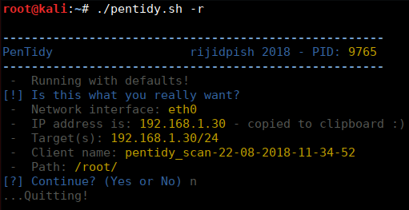

# pentidy 
A bash script to setup a consistently organised working directory for notetaking on internal network pentest / CTFs etc. 
It does some basic enumeration using a few tools packaged with kali linux. 
The aim is to make the first stages of an internal pentest as consistant as possible. 

It's designed and tested to run on kali but you can always just install the dependencies listed below.

#### Features
* Creates a consistent working directory along with some note template files.
* Runs network sweep on specified range which can be a single target or entire network range. 
* Creates additional target folders based on active hosts found.
* If certain default ports are found, runs a few enumeration tools and saves output logs.
* Generates some popular reverse shell one-liner commands and shellcode using the current IP address.
* Downloads .odt report template, updates custom values and adds discovered targets and scan results.
* On completion, it will import some of the data into a new metasploit workspace.
* Finish up by starting a new tmux session with preset windows and panes.

#### Issues
* Too many to list... search for "TODO", "FIXME" and "XXX" in the script :)

#### Dependencies
Here is a list of tools that are used in the script:

* metasploit
* postgresql
* fping
* nikto
* dirb
* gobuster
* cewl
* nmap
* unicornscan
* john
* enum4linux
* xmllint
* tmux

Example usage: <code>./pentidy.sh -p /root/Desktop/ -c test -i eth0 -t 192.168.1.0/24 -uRg</code> 
Or just run with defaults: <code>./pentidy.sh -r</code> 

